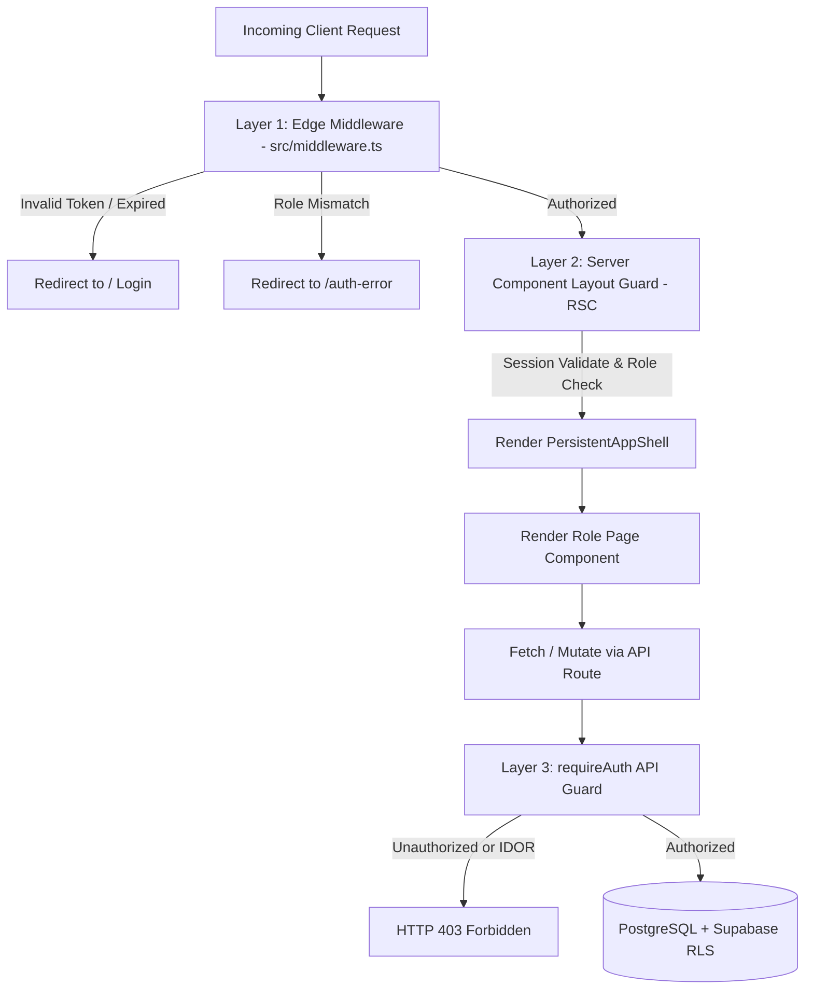

# Design Specification: Persistent Multi-Role Design System & Security Architecture

**Date:** 2026-10-04  
**Status:** Approved  
**Topic:** Persistent Design Shell for Admin, Faculty, and Student Roles & Multi-Tier Security Hardening  
**Target Platform:** Next.js 15 (App Router), Supabase PostgreSQL, Azure AD MSAL, TailwindCSS  

---

## 1. Executive Summary

This specification addresses two core weaknesses in the current WebC Student Clearance application:
1. **Design Fragmentation**: The interface currently uses divergent layouts across user types—Admin uses a custom dark sidebar, Faculty has a light sidebar with breadcrumbs, and Student has two conflicting implementations (`/student` with a bare card list and `/clearance` with top tabs).
2. **Security Vulnerabilities**: Edge middleware is currently inactive because it is misnamed as `src/proxy.ts` rather than `src/middleware.ts`; session tokens minted from Azure AD in `/api/session` are ignored by `getSession()` in favor of Supabase auth cookies; server component layouts hardcode roles without server-side claims validation; and API endpoints lack consistent role-based access control (RBAC).

This design introduces a **Unified Persistent App Shell** across Admin, Faculty, and Student roles using the **Collegiate Modernist** visual identity, and establishes a **3-Tier Defense-in-Depth Security System** (Edge Middleware $\rightarrow$ Server Component Layout Guards $\rightarrow$ API Route Authorization Guards).

---

## 2. Design System & Visual Identity (`frontend-design`)

### 2.1 Aesthetic Persona: "Collegiate Modernist / Academic Precision"
An authoritative, modern academic design language that honors institutional prestige and clarity:
- Replaces generic grey dashboards with high-contrast, purposeful academic styling.
- High data legibility with clean typography and tabular alignment.
- Meaningful micro-interactions reinforcing official institutional actions (clearance signing, status stamps).

### 2.2 Design Token System

| Token Name | Hex Code | Purpose |
| :--- | :--- | :--- |
| `institutional-navy` | `#0B192C` | Persistent sidebar background, headers, high-emphasis text, primary buttons |
| `sti-gold` | `#F59E0B` | Accent highlights, signature buttons, pending clearance status, progress meters |
| `alabaster-canvas` | `#F8FAFC` | Page canvas background |
| `pure-surface` | `#FFFFFF` | Card surfaces, modals, popovers, table rows |
| `slate-border` | `#E2E8F0` | Subtle hairline borders, dividers, tab rings |
| `verified-emerald` | `#10B981` | Signed clearance badges, verified requirements, successful actions |
| `alert-crimson` | `#EF4444` | Deficiencies, rejected task submissions, destructive actions |
| `info-indigo` | `#6366F1` | Institutional announcements, audit logs, system notices |

### 2.3 Typography Scale
- **Display / Navigation**: Humanist Sans-Serif (Geist / Inter) with intentional weights (`font-semibold` / `font-bold` for headings and brand anchors).
- **Tabular / Identifiers**: Tabular Monospace (`font-mono`) for Student Numbers (`student_id`), Clearance Reference Codes, and Audit Timestamps.

### 2.4 Signature Element: "The Clearance Seal & Approval Chain"
A dedicated, interactive institutional status widget displayed on student clearance overviews and faculty verification panels:
- Embossed-style seal reflecting the student's overall clearance completion percentage.
- Connected horizontal/vertical sequential chain showing departments in their configured signing order (e.g. Dean $\rightarrow$ Library $\rightarrow$ Guidance $\rightarrow$ Finance $\rightarrow$ Registrar).
- Distinct states:
  - **Verified**: Emerald check with timestamp and staff signature name.
  - **In Progress / Current**: Gold glowing ring with action link.
  - **Locked**: Muted padlock indicating required prerequisite department sign-off.
  - **Deficiency**: Crimson alert with link to rejected or pending task upload.

---

## 3. Persistent App Shell Architecture

All three roles share a single layout architecture component: `<PersistentAppShell>`.

```
+-------------------------------------------------------------------------------+
| TOP UTILITY BAR: [Logo (mobile)] [Breadcrumbs]          [Notifications] [Profile/Sign-out] |
+-----------------------+-------------------------------------------------------+
| COLLAPSIBLE SIDEBAR   | MAIN CONTENT WORKSPACE                                |
| - Institution Header  |                                                       |
| - Role Indicator Badge|                                                       |
|   (Admin / Faculty /  |   Max-width 1600px responsive container               |
|    Student)           |   Role-specific views & data tables                   |
|                       |                                                       |
| - Navigation Links    |                                                       |
|                       |                                                       |
| - Collapse Toggle     |                                                       |
+-----------------------+-------------------------------------------------------+
```

### 3.1 Shell Structure
1. **Collapsible Sidebar (Desktop)**:
   - Width: 260px expanded, 72px collapsed (icon-only mode with floating tooltips).
   - Institution branding: STI College / WebC logo.
   - Distinctive Role Badge:
     - Admin: `Admin Workspace` (Navy pill with Gold shield icon)
     - Faculty: `Faculty Hub` (Navy pill with GraduationCap icon)
     - Student: `Student Clearance` (Navy pill with UserCheck icon)
2. **Mobile App Navigation**:
   - Left slide-out drawer on `< 1024px` triggered by a header hamburger button.
   - For students on mobile, persistent bottom quick-action bar for instant task upload and status checking.
3. **Top Utility Bar (Sticky Header)**:
   - Dynamic Breadcrumbs reflecting active subpage (e.g. `Faculty > Dashboard > Priority Sign Queue`).
   - Live Notification Popover (listening to Supabase Realtime).
   - Profile Dropdown with user name, email, role, and MSAL Azure sign-out button.

### 3.2 Role-Specific Navigation Manifests

#### Admin Role (`/admin`)
- **Dashboard**: High-level clearance completion velocity, bottleneck departments, student stats.
- **Students**: Master student roster with search, section filters, balance checks, and status.
- **Templates**: Course and staff template assignment matrices.
- **Hierarchy**: Clearance department signing order and prerequisite workflow configurator.
- **Audit Reports**: Immutable clearance logs, signature history, and CSV export.

#### Faculty / Department Role (`/department`)
- **Dashboard**: Department metrics (pending vs. signed count, today's signatures).
- **Student Queue**: Actionable roster of students requiring department clearance:
  - *Ready to Sign* (Prerequisites met & requirements satisfied) with quick-sign batch button.
  - *Prerequisite Pending* (Locked by hierarchy).
- **Task Presets**: Create, edit, and assign department requirement templates (e.g. "Laboratory Clearance").
- **Office Hours**: Schedule publisher showing students when faculty is available for sign-offs.

#### Student Role (`/student`)
- **My Clearance**: Clearance Seal, department sequential progress, and status list.
- **Requirements & Tasks**: Document submission dropbox with file preview, submission comments, and review statuses (`Pending`, `Submitted`, `Rejected`, `Verified`).
- **Department Directory & Schedule**: List of clearing departments with office hours, venue, and faculty in charge.
- **History**: Historical signed clearances and digital completion slip.

---

## 4. Multi-Tier Security Architecture (`using-superpowers`)



### 4.1 Layer 1: Edge Middleware (`src/middleware.ts`)
- **File Relocation**: Rename/replace `src/proxy.ts` with standard Next.js `src/middleware.ts` with matcher:
  ```typescript
  matcher: [
    "/admin/:path*",
    "/department/:path*",
    "/student/:path*",
    "/clearance/:path*",
    "/api/admin/:path*",
    "/api/department/:path*",
    "/api/student/:path*",
  ]
  ```
- **Execution Logic**:
  1. Read `session_token` cookie from request.
  2. Verify JWT signature using `jose` with `SESSION_SECRET`.
  3. Inspect `payload.role`:
     - Accessing `/admin/*` without role `Admin` $\rightarrow$ Redirect to `/auth-error?reason=unauthorized`.
     - Accessing `/department/*` without role `Staff`, `Department`, or `Admin` $\rightarrow$ Redirect to `/auth-error`.
     - Accessing `/student/*` without role `Student` or `Admin` $\rightarrow$ Redirect to `/auth-error`.
     - Accessing `/clearance/*` $\rightarrow$ Permanently redirect (HTTP 301) to `/student`.
  4. Attach verified user context (`x-user-id`, `x-user-role`, `x-user-department`) in request headers forwarded to downstream route handlers and RSCs.

### 4.2 Layer 2: Synchronized Session Provider & Server Layout Guards
- **Refactoring `src/lib/auth/get-session.ts`**:
  - Read `session_token` cookie.
  - Verify and decode payload containing:
    ```typescript
    export interface AppSession {
      user_id: string;
      user_email: string;
      user_name: string;
      role: "Admin" | "Staff" | "Department" | "Student";
      department?: string;
    }
    ```
  - Eliminates mismatch where Azure MSAL login creates `session_token` while `get-session.ts` checked non-existent Supabase auth sessions.
- **Server Component Layout Guards**:
  - `src/app/(pages)/admin/layout.tsx`:
    ```typescript
    const session = await getSession();
    if (session.role !== "Admin") redirect("/auth-error");
    ```
  - `src/app/(pages)/department/layout.tsx`:
    ```typescript
    const session = await getSession();
    if (!["Staff", "Department", "Admin"].includes(session.role)) redirect("/auth-error");
    ```
  - `src/app/(pages)/student/layout.tsx`:
    ```typescript
    const session = await getSession();
    if (!["Student", "Admin"].includes(session.role)) redirect("/auth-error");
    ```

### 4.3 Layer 3: API Route Guard Wrapper (`requireAuth`)
- Standardized wrapper `src/lib/auth/require-auth.ts`:
  ```typescript
  export async function requireAuth(
    req: NextRequest,
    allowedRoles?: ("Admin" | "Staff" | "Department" | "Student")[]
  ): Promise<AppSession>
  ```
- **IDOR Protection & Context Enforcement**:
  - In `/api/department/clients/quick-sign`: Verifies caller's `department` matches the clearance template's `dept_id`.
  - In `/api/student/tasks/submit`: Verifies student can only submit files for their own `user_id`.

---

## 5. Route Consolidation & Student Portal Unification

- Deprecate `/clearance`.
- Consolidate all clearance tabs into `/student`:
  - `/student` (default: Overview & Clearance Seal)
  - `/student?tab=tasks` (Task submission & dropbox)
  - `/student?tab=offices` (Department schedules & office hours)
- Next.js permanent redirect in `next.config.ts` or `middleware.ts` from `/clearance` to `/student`.

---

## 6. Audit Logging & Error Boundaries

### 6.1 Audit Logging
- Every signature change, clearance status override, and task verification must insert into `clearance_logs`:
  - `staff_id`: Verified session user ID
  - `message`: Human-readable summary (e.g., "Signed clearance for Student 2023-00124")
  - `actions`: Action enum (`SIGN`, `REJECT_TASK`, `VERIFY_TASK`, `OVERRIDE`)
  - `created_at`: `CURRENT_TIMESTAMP`

### 6.2 Error Boundary Page (`/auth-error`)
- Displays an institutional, user-friendly card:
  - Specific explanation of why access was denied (e.g. role mismatch).
  - One-click navigation back to the user's authorized role home.
  - Sign-out button for switching accounts.

---

## 7. Verification & Testing Plan

1. **Security & RBAC Tests**:
   - Access `/admin/dashboard` as unauthenticated visitor $\rightarrow$ Redirect to `/`.
   - Access `/admin/dashboard` with Student session cookie $\rightarrow$ Redirect to `/auth-error`.
   - Access `/department/dashboard` with Student session cookie $\rightarrow$ Redirect to `/auth-error`.
   - Request `POST /api/admin/departments` with non-admin session $\rightarrow$ HTTP 403 Forbidden.
   - Quick-sign student record from unauthorized department $\rightarrow$ HTTP 403 Forbidden.
2. **Design & Responsiveness Tests**:
   - PersistentAppShell sidebar expand/collapse state remembered in cookies/localStorage.
   - Mobile hamburger drawer functions seamlessly on `< 1024px` widths.
   - Design tokens (Collegiate Modernist navy/gold/emerald) render consistently across all three role portals.
   - Full TypeScript compilation (`npx tsc --noEmit`) passes with zero errors.
   - Production build (`npm run build`) succeeds.
